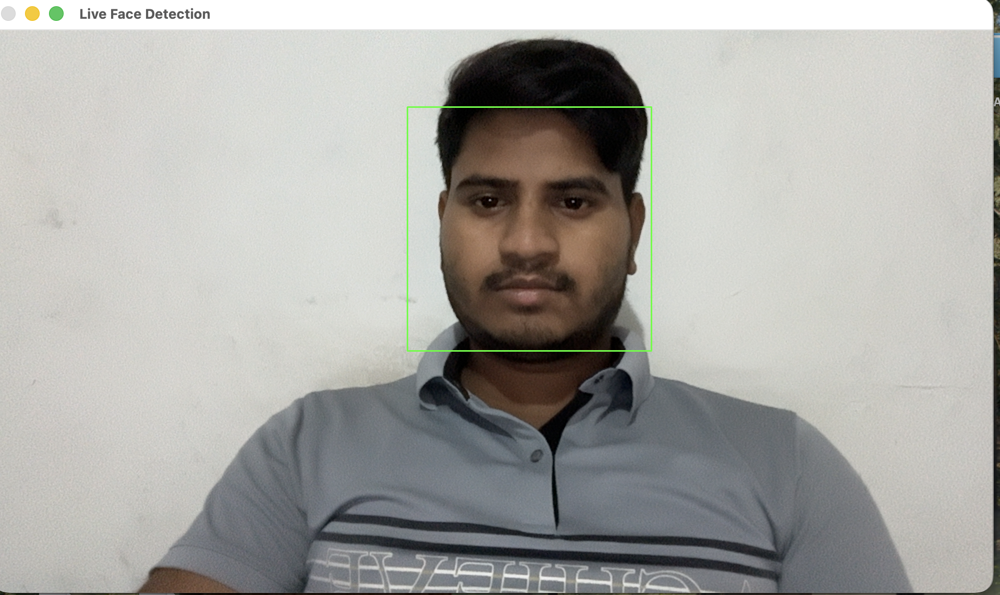

# Live Face Detection Project

## Overview

This project is a real-time face detection application built using Python and OpenCV. It captures live video from a webcam and detects human faces using the Haar Cascade Classifier. Detected faces are highlighted with green rectangles.

## Features

* Real-time webcam face detection
* Haar Cascade based face recognition
* Optional mirror mode
* Automatic face bounding boxes
* Simple and lightweight implementation
* Exit application using the ESC key

## Technologies Used

* Python 3
* OpenCV (cv2)
* Haar Cascade Classifier

## Project Structure

```text
faceDetectionProject/
│
├── live_face_detection.py
└── README.md
```

## Requirements

Install OpenCV:

```bash
pip install opencv-python
```

## How to Run

Run with mirror mode enabled (default):

```bash
python3 live_face_detection.py
```

Run without mirror mode:

```bash
python3 live_face_detection.py --no-mirror
```

## How It Works

1. Opens the webcam.
2. Loads the Haar Cascade face detection model.
3. Captures video frames continuously.
4. Converts frames to grayscale.
5. Detects faces in each frame.
6. Draws green rectangles around detected faces.
7. Displays the live video feed.
8. Press ESC to close the application.

## Output## Screenshot



* Webcam video stream appears in a window named **Live Face Detection**.
* Detected faces are marked with green rectangles.
* Console displays the current mirror mode status.

## Future Improvements

* Face recognition using DeepFace
* Face attendance system
* Emotion detection
* Age and gender prediction
* Face mask detection

## Author

Shubham Kumar
B.Tech CSE Student
GITAM College, Delhi NCR
